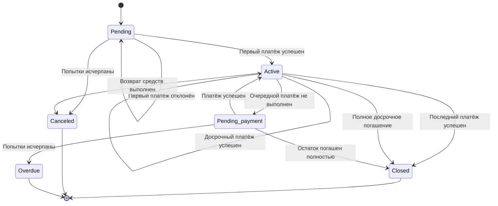

## 1. Статусы

## **Pending**
**Описание:** Договор создан и находится в режиме ожидания первого платежа. 

## **Active**
**Описание:** Договор активен. Первый платёж успешно выполнен, при этом договор ещё не погашен полностью.

## Closed
**Описание:** Договор закрыт. Все обязательства по договору исполнены.

## Canceled
**Описание:** Договор отменён. Дальнейшее исполнение договора прекращено.

## Pending Payment
**Описание:** Очередной платёж не был выполнен, система находится в процессе повторных попыток списания.

## Overdue
**Описание:** Договор в статусе просрочки платежа. Установленное количество попыток списания исчерпано, договор передан на взыскание.

## 2. Переходы между статусами

| Текущий статус    | Событие                      | Новый статус      | Условие                                               |
| ----------------- | ---------------------------- | ----------------- | ----------------------------------------------------- |
| `Pending`         | Первый платёж успешен        | `Active`          | Платёж подтверждён                                    |
| `Pending`         | Первый платёж отклонён       | `Pending`         | Остались попытки                                      |
| `Pending`         | Попытки исчерпаны            | `Canceled`        | 3 неудачные попытки                                   |
| `Active`          | Очередной платёж успешен     | `Active`          | Остались платежи                                      |
| `Active`          | Последний платёж успешен     | `Closed`          | Все платежи выполнены                                 |
| `Active`          | Досрочный платёж успешен     | `Active`          | Договор не погашен полностью                          |
| `Active`          | Полное досрочное погашение   | `Closed`          | Остаток погашен полностью                             |
| `Active`          | Очередной платёж не выполнен | `Pending Payment` | Остались попытки                                      |
| `Pending Payment` | Платёж успешен               | `Active`          | —                                                     |
| `Pending Payment` | Платёж успешен               | `Closed`          | Остаток погашен полностью                             |
| `Pending Payment` | Попытки исчерпаны            | `Overdue`         | 10 неудачных попыток в течение установленного периода |
| `Active`          | Возврат средств выполнен     | `Canceled`        | Отмена разрешена                                      |

## 3. Диаграмма состояний

